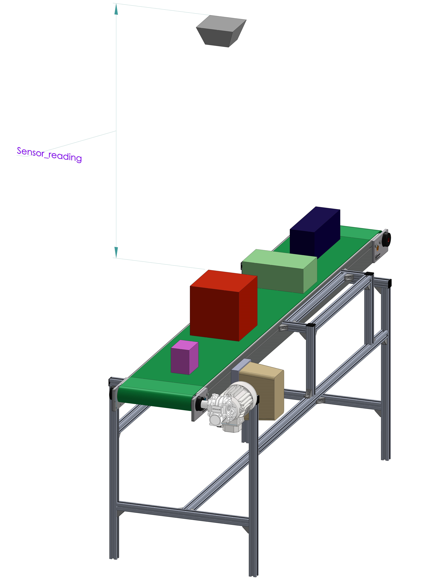
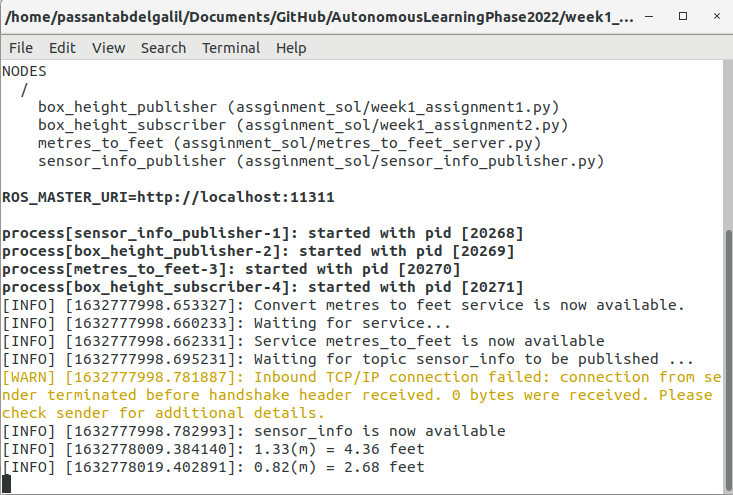

# Week 1 ROS Essentials Assignments

This folder contains my solutions for Week1 (ROS Essentials) Assignments, implemented in ros c++/python.
# Task Definition
The main task of is to publish a new topic that contains the height of the detected boxes (in metres) based on the setup shown in the figure, and this information has to be converted to feet using the ”metres_to_feet” ROS service.



# Output

<br><br><br>

# Folder Structure

```
├── week1_ws
|   ├── src
|   |   ├── assignment_sol
|   |   |   ├── scripts    # python scripts for ros application
|   |   |   |   ├── meters_to_feet_server.py  # script to advertise the metres_to_feet service
|   |   |   |   ├── sensor_info_publisher.py # script to publish generated sensor data
|   |   |   |   ├── week1_assignment1.py    # script to calculate box height in metres
|   |   |   |   └── week1_assignment2.py    # script to convert height in metres to feet
|   |   |   |
|   |   |   ├── src
|   |   |   |   ├── meters_to_feet_server.cpp # cpp file to advertise the metres_to_feet service
|   |   |   |   ├── sensor_info_publisher.cpp # cpp file to publish generated sensor data
|   |   |   |   ├── week1_assignment1.cpp   # cpp file to calculate box height in metres
|   |   |   |   └── week1_assignment2.cpp   # cpp file to convert height in metres to feet
|   |   |   |
|   |   |   └── include
|   |   |   
|   |   └── week1ws_msgs    # ROS package for this project messages
|   |       ├── msg     # custome message types definition files
|   |       |   ├── BoxHeightInformation.msg
|   |       |   └── SensorInformation.msg
|   |       |   
|   |       ├── srv     # services definition files
|   |       |   └── ConvertMetersToFeet.srv
|   |       |
|   |       ├── CMakeLists.txt
|   |       └── package.xml
|   |   
|   ├── test_execs.sh   # bash script to test ros c++ files
|   └── test_scripts.sh # bash script to test rospy scripts
|
└── README.md
```

# Run
1. it's assumed you are in week1_ws folder, if not please cd your terminal to it.
2. to run c++ executables, please run `./test_execs.sh`
3. to run python scripts, please run `./test_scripts.sh`