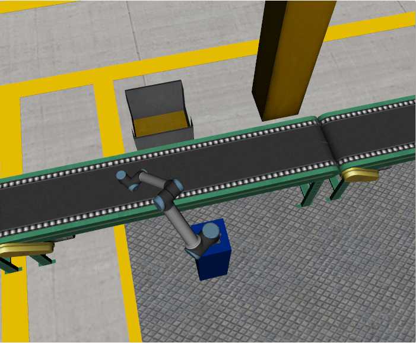
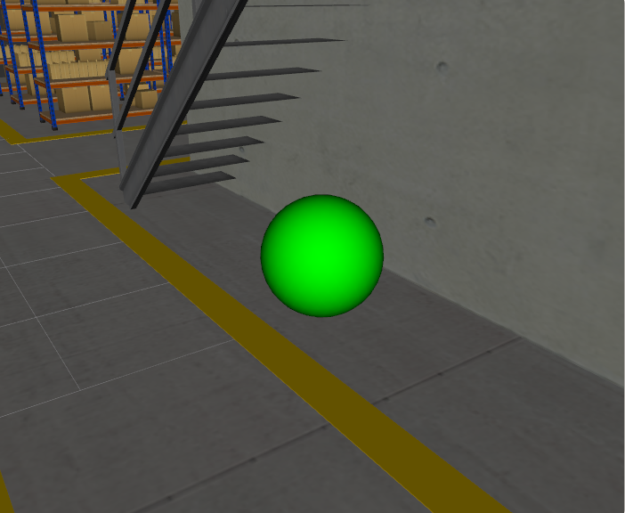
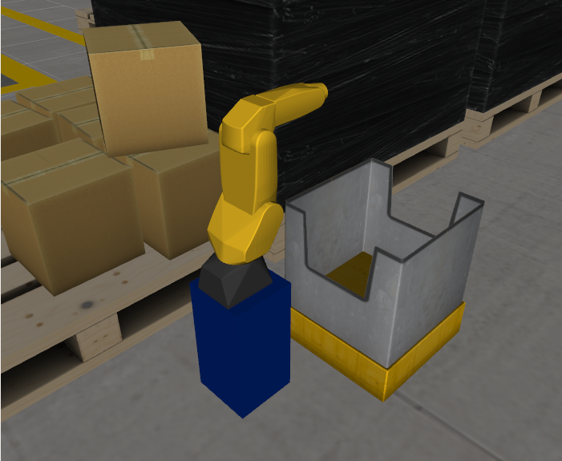

# Week 2 Assignment Solutions

This folder contains source files for week-2 assignments serves as a practice on simulation using RViz


# Task Definition
## Task 1
The goal is to add a new model to the factory, which is a second bin that should be placed on the opposite side of the conveyor, right in front of Robot 1.

## Task 2
The goal is to add a new model to the factory, which is a green sphere that should be placed on the opposite side of the conveyor, underneath the stairs at the far end of the factory.

## Task 3
The goal is to replace Robot 2 (the UR5) with a different robot from another ROS package: `the Fanuc LR Mate 200iC`  with an identical orientation as the UR5 and it should point in the same direction as the UR5


# Output
## Task 1


## Task 2

## Task 3


# Folder Structure

```
├── week2_ws
|   ├── src
|   |   ├── assignment_sol
|   |   |   ├── config    # config files for RViz to visualize the world
|   |   |   |   ├── assignemnt1.rviz  
|   |   |   |   ├── assignemnt2.rviz 
|   |   |   |   ├── assignemnt3.rviz 
|   |   |   |   └── view_robot.rviz 
|   |   |   |
|   |   |   ├── launch   # launch files to start the simulation
|   |   |   |   ├── visualize_hrwros_assignment1.launch
|   |   |   |   ├── visualize_hrwros_assignment2.launch
|   |   |   |   └── visualize_hrwros_assignment3.launch
|   |   |   ├── meshes  # meshes for lrmate200ic robot for simulation sake
|   |   |   |   └── lrmate200ic/
|   |   |   |
|   |   |   ├── urdf    # Xacro files to construct the world
|   |   |   |   ├── robot/
|   |   |   |   ├── include/
|   |   |   |   ├── hrwros_assignment1.xacro
|   |   |   |   ├── hrwros_assignment2.xacro
|   |   |   |   └── hrwros_assignment3.xacro
|   |   |   |
|   |   |   ├── CMakeLists.txt
|   |   |   ├── package.xml
|   |   |   └── readme.md
|   |   |   
|   |   ├── support   # macro files to use to simplify xacro files
|   |   |   ├── meshes/
|   |   |   ├── urdf/
|   |   |   ├── CMakeLists.txt
|   |   |   └── package.xml
|   |   |
|   |   └── ur_description/  # package to view and manipulate the arm models in rviz
|   |   
|   ├── run_assignemnt1.sh   # bash script to run assignment 1 simulation
|   ├── run_assignemnt2.sh   # bash script to run assignment 2 simulation
|   └── run_assignemnt3.sh   # bash script to run assignment 3 simulation 
|
└── README.md
```

# Run
## Assignment 1
* Drag & Drop `run_assignment1.sh`  
OR
* open terminal in week2_ws folder and run `./run_assignment1.sh`
## Assignment 2
* Drag & Drop `run_assignment2.sh`  
OR
* open terminal in week2_ws folder and run `./run_assignment2.sh`
## Assignment 3
*  Drag & Drop `run_assignment3.sh`  
OR
* open terminal in week2_ws folder and run `./run_assignment3.sh`