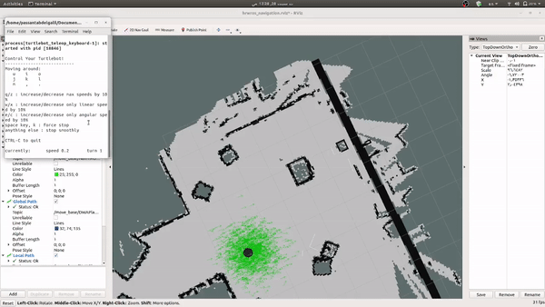

# Week 2 Assignment Solutions

This folder contains source files for week-3 assignments serves as a practice on mapping & navigation and simulating it using RViz.

# Task Definition
## Task 1
The goal is to setup the environment and manually navigate the turtlebot so that the AMCL improves the robot’s estimation of its position.

## Task 2
The goal is to visualize the plans that the TurtleBot is using to navigate autonomously 
## Task 3
The goal is to command navigation goals to the TurtleBot using a ROS node that implements a simple action client interface to the move_base action server.

# Output
## Task 1


## Task 2


## Task 3


# Folder Structure

```
├── week3_ws
|   ├── src
|   |   ├── assignment_sol
|   |   |   ├── config    # config files for mapping
|   |   |   |   ├── map_factory_v1.pgm  
|   |   |   |   └── map_factory_v1.yaml 
|   |   |   |
|   |   |   ├── launch   # launch files to start the simulation
|   |   |   |   ├── hrwros_turtlebot_navigation.launch
|   |   |   |   ├── hrwros_view_navigation.launch
|   |   |   |   ├── week3_assignment3_part1.launch
|   |   |   |   └── week3_assignment3_part2.launch
|   |   |   |
|   |   |   ├── rviz    # rviz configuration files
|   |   |   |   └── hrwros_navigation.rviz
|   |   |   |
|   |   |   ├── scripts   # script files
|   |   |   |   ├── create_unknown_obstacles.py
|   |   |   |   ├── week3_assignment3_part1.py
|   |   |   |   └── week3_assignment3_part2.py
|   |   |   |
|   |   |   ├── CMakeLists.txt
|   |   |   └── package.xml
|   |   |   
|   |   ├── support/   # package to support constructing the world
|   |   |
|   |   ├── hrwros_gazebo/ # pakcage to construct gazebo world
|   |   |
|   |   ├── src/   # turtlebot files
|   |   |
|   |   └── ur_description/  # package to view and manipulate the arm models in rviz
|   |   
|   ├── test_scripts_part1.sh   # bash script to run task 2
|   └── test_scripts_part2.sh   # bash script to run task 3 simulation 
|
└── README.md
```

# Run
## Task 2
* Drag & Drop `test_scripts_part1.sh`  
OR
* open terminal in week2_ws folder and run `./test_scripts_part1.sh`
## Task 3
*  Drag & Drop `test_scripts_part2.sh`  
OR
* open terminal in week2_ws folder and run `./test_scripts_part2.sh`